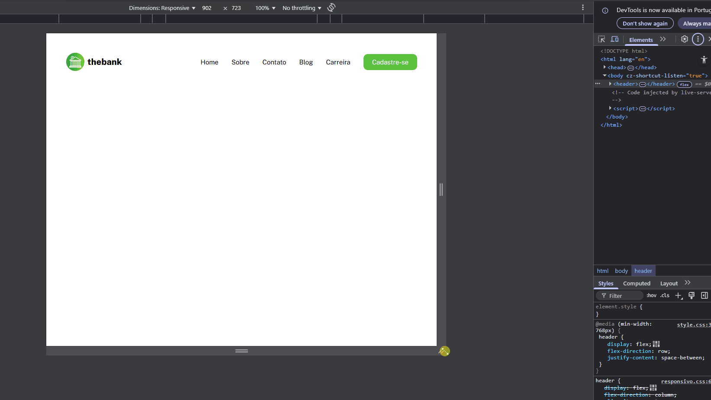

# Menu com flex

Exercício prático aplicando conceitos de responsividade utilizando Flexbox.

O exercício foi proposto no curso DevEmDobro, ao final do módulo CSS3 — Avançado — Flex, com o objetivo de testar e fixar o aprendizado dos alunos.

## 💡 Conceitos aplicados
- Layout responsivo
- Flexbox
- Estratégia de mobile first (primeiro desenvolvendo o layout para dispositivos móveis e depois adaptando para telas maiores)

## 💻 Tecnologias usadas
- HTML5
- CSS3
- Markdown (para criação desse readme)